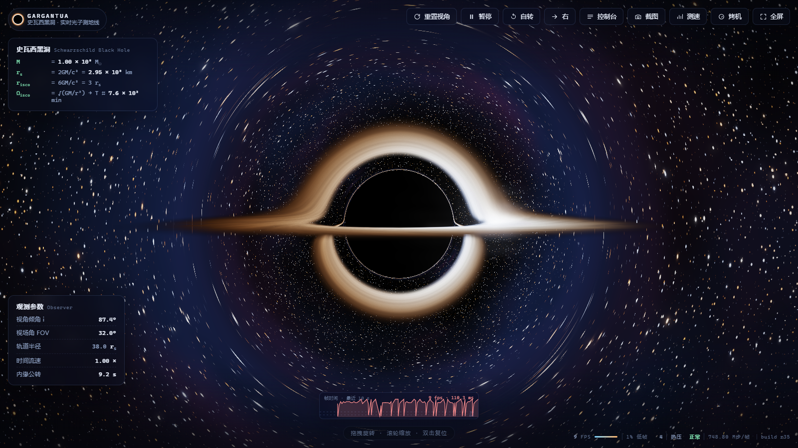

# GARGANTUA · 史瓦西黑洞实时引力透镜

单文件网页（WebGL2）：在浏览器里逐像素求解光子测地线，实时呈现史瓦西黑洞的引力透镜、吸积盘与光子环。全部样式与脚本内联，不依赖任何外部资源，双击即可离线打开。

主要是用来测试手机 / 电脑 / 平板上的性能释放：自带 GPU 渲染压力、CPU 全核浮点压力与双烤模式，用来观察持续满载下的降频情况。

## 特性

- 逐像素 RK4 求解史瓦西时空中的光子零测地线（`u'' = -u + 1.5·r_s·u²`），纯片元着色器实现
- 薄吸积盘：多普勒增亮、引力红移、黑体色温、湍流纹理、可转向的局部热斑
- 引力透镜光环 / 光子环、程序化星空与银河带
- HDR 半浮点渲染 + 泛光 + ACES 色调映射 + 暗角与颗粒（无浮点支持时自动回退 8 位）
- 渲染质量：**1080P / 2K / 2.5K / 3K / 4K** 点按选择（按渲染短边，4K 即 3840×2160 级别）
- 超采样倍率、输出分辨率（高级）、渲染像素预算
- 自适应清晰度（点按开关）：按 rAF 帧间隔闭环自动调分辨率，不依赖 `gl.finish`；最低渲染分辨率默认 1080P
- 帧率不封顶：始终交给显示器刷新率与自适应
- 设备信息面板：GPU 型号、渲染后端（硬件 / 软件）、刷新率实测、帧间隔中位数、显存探测
- 压力测试面板：**烤 GPU / 烤 CPU / 双烤** 三种压力目标可切换——CPU 档用全部核心的 Worker 跑浮点运算并给出吞吐与降频判定，GPU 档把黑洞渲染拉满，双烤两路同时满负载；附平均帧率 / 1% 低帧 / 最低帧统计
- 完整键盘快捷键与移动端手势（拖拽旋转、双指缩放、双击复位）

## 使用

- 直接下载 `index.html` 并用浏览器打开（需要 WebGL2；Chrome / Edge / Firefox 均可）
- 或 fork 后开启 GitHub Pages（Settings → Pages → Deploy from branch → main / root），即可在线访问

## 操作

- 鼠标：拖拽旋转 · 滚轮缩放 · 双击复位
- 触屏：单指旋转 · 双指缩放 · 双击复位
- 快捷键：`R` 复位 · `空格` 暂停 · `T` 自转 · `D` 转向 · `C` 控制台 · `S` 截图 · `B` 测速 · `P` 烤机 · `F` 全屏 · `H` 隐藏界面

## 参数

控制台（按 `C`）内可调：透镜强度、多普勒增亮、引力红移、吸积盘内外缘 / 温度 / 亮度 / 湍流 / 热斑、视角倾角 / 轨道半径 / 视场角、时间流速、自转速度、星密度与星云、曝光、泛光、渲染质量档位（1080P–4K）、自适应清晰度开关、最低渲染分辨率、超采样、输出分辨率、像素预算。

## 性能提示

- 「设备信息 → 渲染后端」会区分「核显 / 独显 / 软件渲染」：
  - 显示"软件渲染（走 CPU）"：打开浏览器硬件加速，然后完全重启浏览器；
  - 显示"硬件加速（核显）"而机器有独立显卡：Windows 设置 → 系统 → 屏幕 → 显示卡 → 找到浏览器 → 图形首选项选「高性能」（或 NVIDIA 控制面板 → 管理 3D 设置 → 程序设置 → 指定高性能），然后完全退出浏览器再打开。
- 判断瓶颈：把「**帧间隔中位数**」与「**刷新率（实测）**」对照——≈1× 屏幕周期 = 正在跑满刷新率；≈2× = 掉了一半帧；≈3× 在 120Hz 屏上就是 40fps。
- 自适应清晰度默认最低 1080P；想要更高帧率，可在控制台把「最低渲染分辨率」调成 720P 或"不限制"，或把「渲染质量」降到 1080P。

## 让页面跑在独立显卡上（无 MUX 的混合输出笔记本）

网页本身无法选择显卡（GPU 由系统 / 驱动按进程分配），但页面会在「设备信息 → 渲染后端」里标明当前跑在 **核显 / 独显 / 软件渲染** 上，并给出下一步指引。想让浏览器用独显：

1. 确认独显处于启用状态：奥创中心（Armoury Crate）里不要开「集显模式 / iGPU 模式」（会把独显整个断电）；设备管理器 → 显示适配器 里 NVIDIA 不能是禁用或未连接状态；
2. 把浏览器指定为「高性能 GPU」：Windows 设置 → 系统 → 屏幕 → 显示卡 → 找到浏览器 → 高性能；或直接运行 `tools/windows-use-high-performance-gpu.bat`（写入用户级注册表，等价于上一步，`tools/windows-restore-gpu-preference.bat` 可还原）；或 NVIDIA 控制面板 → 管理 3D 设置 → 程序设置 → 高性能；
3. 完全退出浏览器（含后台进程）再打开，回到页面确认「渲染后端」显示「硬件加速（独显）」。

## 兼容性

- 需要 WebGL2。`EXT_color_buffer_float` 可用时走 RGBA16F HDR 管线，否则自动回退 8 位。
- 已在桌面 Chrome / Edge 与 Android Chrome 上验证。

## English

A single-file WebGL2 playground that integrates null geodesics of the Schwarzschild metric per pixel in real time, featuring gravitational lensing, a thin accretion disk with Doppler beaming and gravitational redshift, bloom + ACES tone mapping, resolution presets (1080p / 2K / 2.5K / 3K / 4K), adaptive resolution with a 1080p floor, device diagnostics and a built-in stress-test panel. Just open `index.html` — everything is inlined and works offline.

## License

[MIT](LICENSE)